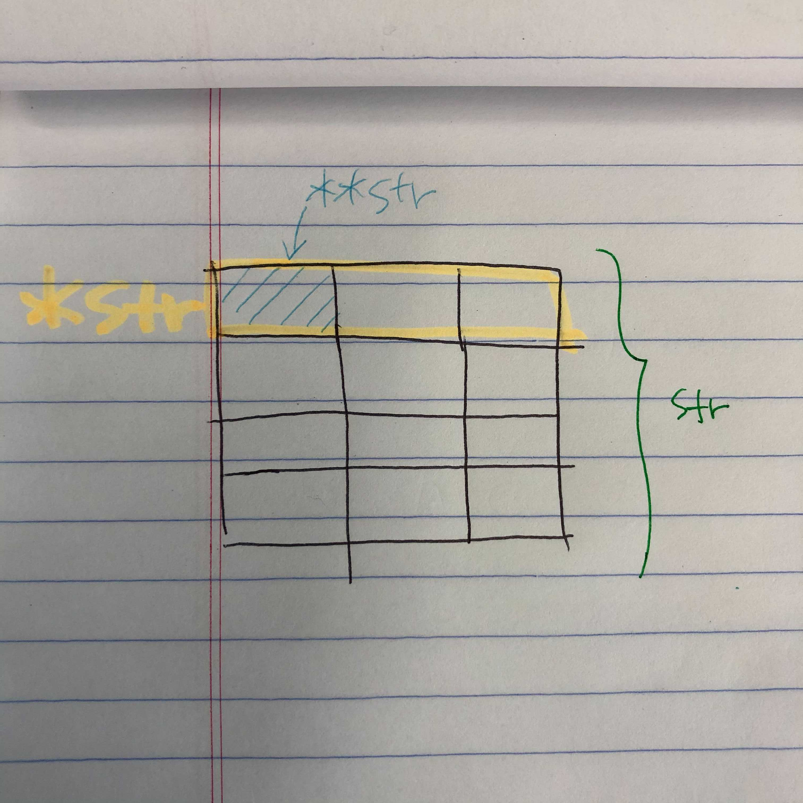

- 분명 과제 제출 기한은 라피신보다 넉넉한데 어째 더 쪼달리는 기분이다.
- 노마드코더 챌린지와 병행하려고 했지만 둘 다 놓치는 기분이 들어 챌린지는 포기했다. 지금 생각해보면 잘했지만, 그 새 자바스크립트를 잊어버리지 않을까 걱정이다. 얼른 블랙홀 늘려놔야지.. 
- 여전히 **포인터의 늪**에서 허우적거리고 있다.



*보아하니 이후에도 계속 고통받을 것같으니 초반에 확실하게 개념을 잡아놓는 것으로..!*

- 예상은 하고 있었지만(어쩌면 당연한 것일 수도 있고) 이 프로그램에 임하는 목적이나 바라보는 시각이나 꽤나 다양했다. 그저 나는 내 초심 그대로 나아가는 걸로..!
- 문제를 틀리는 여러 이유 중에 가장 잦은 이유들을 보면 다음과 같다.
```
1. 문제를 제대로 읽지 않는다
2. 기본기 부족(예를 들면 0과 \0의 차이?)
3. ;의 부재
4. make re의 부재
5. 슬랙과 디스코드를 적극 활용하지 않음
```
- 클러스터와의 거리가 가깝지 않아 가끔 오기 귀찮지만 혼자하면 능률이 오르지 않기 때문에 매일 간다.
- 의외로 식비가 많이 든다..(게다가 개포동에서는 마라탕집이 없지-0-)
- 인사성이 밝은 분들이 많이 계신다(나도 배워야지)
- 그리고 얼른 libft를 끝내야겠다.

앞으로의 1달이 더 기대된다.

커밍 쑨~~~~~~~~~~~~