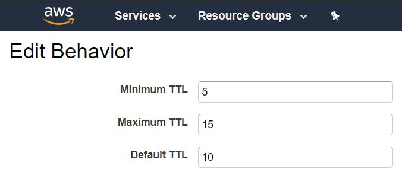

## 1. Cache 설정

- Minimum TTL: Cache를 최소한 5초 이상 유지한다.
- Maximum TTL: Cache를 최대한 15초 이하로 유지한다.
- Default TTL: Origin에서 Cache를 지정하지 않았다면, 10초 동안 Cache를 살리겠다.
- Origin의 caching time과 CloudFront caching time은 서로 무관하지 않다.

## 2. CDN

- Content Delivery Network
- CloudFront는 기본적으로 CDN임

## 3. CloudFront

- 켜놔도 과금 발생되지 않음 → 사용한만큼 지불
